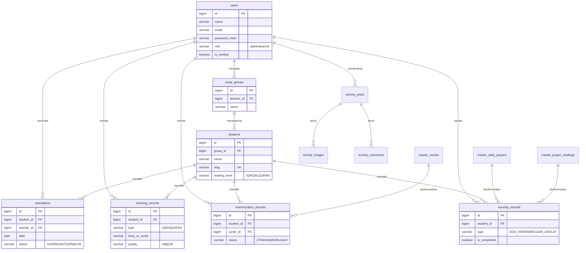
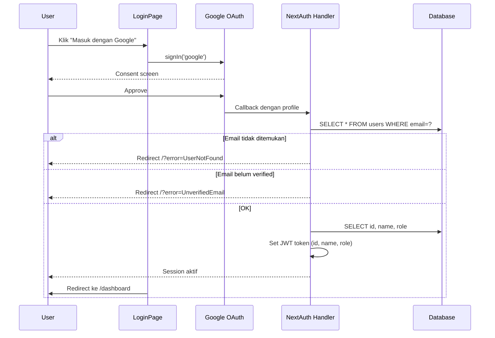
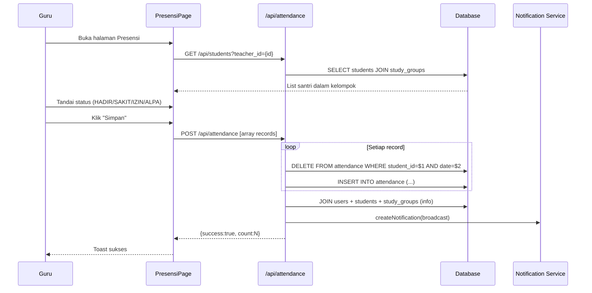
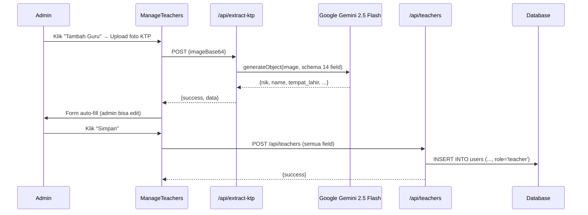

# BAB III — ANALISIS DAN PERANCANGAN SISTEM
## Sistem Pemantauan Akademik dan Hafalan Santri MDA Masjid Nurul Huda

> Dokumentasi teknis hasil reverse-engineering kode sumber aplikasi.
> **Tech Stack:** Next.js 16 (App Router) · React 19 · TypeScript · Tailwind CSS v4 · NeonDB (PostgreSQL) · Drizzle ORM · NextAuth (Google OAuth) · Vercel Blob Storage · Google Gemini AI (OCR KTP)

---

## DAFTAR ISI

1. [Skema Basis Data](#1-skema-basis-data)
2. [Aktor & Hak Akses](#2-aktor--hak-akses)
3. [Fitur & Alur Sistem](#3-fitur--alur-sistem)
4. [Komponen Frontend](#4-komponen-frontend)
5. [Ringkasan Umum](#5-ringkasan-umum)

---

## 1. SKEMA BASIS DATA

Basis data dirancang dalam tiga kelompok logis: **Master Data** (referensi statis), **Core Tables** (entitas utama), dan **Transaction Tables** (catatan aktivitas pembelajaran).

### 1.1 Daftar Tabel & Struktur Kolom

#### A. Master Data (Tabel Referensi)

##### Tabel `master_surahs` — Daftar 114 Surat Al-Qur'an

| Kolom | Tipe Data | Constraint | Keterangan |
|---|---|---|---|
| `id` | BIGSERIAL | PRIMARY KEY | Identifier unik |
| `name_latin` | VARCHAR(100) | NOT NULL | Nama surat (latin) |
| `name_arabic` | VARCHAR(100) | NULL | Nama surat (arab) |
| `total_verses` | INTEGER | NOT NULL | Jumlah ayat |
| `revelation_type` | VARCHAR(20) | NOT NULL, CHECK ∈ {Makkiyah, Madaniyah} | Tempat turun |
| `juz` | VARCHAR(50) | NULL | Letak juz |

##### Tabel `master_daily_prayers` — Doa Harian

| Kolom | Tipe Data | Constraint | Keterangan |
|---|---|---|---|
| `id` | BIGSERIAL | PRIMARY KEY | |
| `title` | VARCHAR(150) | NOT NULL | Judul doa (mis. "Doa Sebelum Tidur") |
| `category` | VARCHAR(50) | NULL | Kategori |
| `arabic_text` | TEXT | NULL | Teks arab |
| `latin_text` | TEXT | NULL | Transliterasi latin |
| `translation` | TEXT | NULL | Terjemahan Indonesia |

##### Tabel `master_prayer_readings` — Bacaan Sholat

| Kolom | Tipe Data | Constraint | Keterangan |
|---|---|---|---|
| `id` | BIGSERIAL | PRIMARY KEY | |
| `step_order` | INTEGER | NOT NULL | Urutan dalam sholat |
| `title` | VARCHAR(150) | NOT NULL | Judul (mis. "Doa Iftitah", "Tasyahud Akhir") |
| `category` | VARCHAR(50) | NULL | Kategori |
| `arabic_text` | TEXT | NULL | Teks arab |
| `translation` | TEXT | NULL | Terjemahan |

#### B. Core Tables (Entitas Utama)

##### Tabel `users` — Pengguna Sistem (Admin DKM & Guru)

| Kolom | Tipe Data | Constraint | Keterangan |
|---|---|---|---|
| `id` | BIGSERIAL | PRIMARY KEY | |
| `name` | VARCHAR(100) | NOT NULL | Nama lengkap |
| `email` | VARCHAR(100) | NOT NULL | Email login |
| `password_hash` | VARCHAR(255) | NOT NULL | Hash password |
| `phone` | VARCHAR(20) | NULL | Nomor HP |
| `role` | VARCHAR(20) | NOT NULL, CHECK ∈ {admin, teacher} | Peran sistem |
| `is_verified` | BOOLEAN | DEFAULT false | Status verifikasi email |
| `verification_token` | VARCHAR(255) | NULL | Token aktivasi |
| `nik` | VARCHAR(50) | NULL | Nomor KTP |
| `tempat_lahir` | VARCHAR(100) | NULL | Hasil OCR KTP |
| `tanggal_lahir` | DATE | NULL | |
| `jenis_kelamin` | VARCHAR(20) | NULL | |
| `golongan_darah` | VARCHAR(5) | NULL | |
| `alamat` | TEXT | NULL | |
| `rt_rw` | VARCHAR(20) | NULL | |
| `kel_desa` | VARCHAR(100) | NULL | |
| `kecamatan` | VARCHAR(100) | NULL | |
| `agama` | VARCHAR(50) | NULL | |
| `status_perkawinan` | VARCHAR(50) | NULL | |
| `pekerjaan` | VARCHAR(100) | NULL | |
| `kewarganegaraan` | VARCHAR(50) | NULL | |
| `created_at` | TIMESTAMP | DEFAULT NOW() | |

##### Tabel `study_groups` — Kelompok Belajar

| Kolom | Tipe Data | Constraint | Keterangan |
|---|---|---|---|
| `id` | BIGSERIAL | PRIMARY KEY | |
| `teacher_id` | BIGINT | FK → users(id) ON DELETE SET NULL | Wali kelompok |
| `name` | VARCHAR(50) | NOT NULL | Nama kelompok (mis. "Iqro 3", "Al-Qur'an Juz 1") |
| `description` | TEXT | NULL | Deskripsi |

##### Tabel `students` — Data Santri

| Kolom | Tipe Data | Constraint | Keterangan |
|---|---|---|---|
| `id` | BIGSERIAL | PRIMARY KEY | |
| `group_id` | BIGINT | FK → study_groups(id) ON DELETE SET NULL | Kelompok belajar |
| `name` | VARCHAR(100) | NOT NULL | Nama santri |
| `slug` | VARCHAR(100) | NOT NULL UNIQUE | Slug untuk URL portal ortu |
| `parent_name` | VARCHAR(100) | NULL | Nama orang tua |
| `parent_phone` | VARCHAR(20) | NULL | No HP orang tua |
| `birth_date` | DATE | NULL | Tanggal lahir |
| `gender` | VARCHAR(1) | CHECK ∈ {L, P} | Jenis kelamin |
| `address` | TEXT | NULL | Alamat |
| `current_level` | VARCHAR(50) | NULL | Level pembelajaran saat ini |
| `reading_level` | VARCHAR(20) | DEFAULT 'IQRO', CHECK ∈ {IQRO, ALQURAN} | Tingkatan baca |
| `iqro_graduated_at` | TIMESTAMP | NULL | Tanggal khatam Iqro |
| `created_at` | TIMESTAMP | DEFAULT NOW() | |

##### Tabel `attendance` — Presensi Harian

| Kolom | Tipe Data | Constraint | Keterangan |
|---|---|---|---|
| `id` | BIGSERIAL | PRIMARY KEY | |
| `student_id` | BIGINT | NOT NULL, FK → students(id) ON DELETE CASCADE | |
| `teacher_id` | BIGINT | NOT NULL, FK → users(id) | Pencatat presensi |
| `date` | DATE | DEFAULT CURRENT_DATE | Tanggal presensi |
| `status` | VARCHAR(10) | NOT NULL, CHECK ∈ {HADIR, SAKIT, IZIN, ALPA} | |
| `notes` | TEXT | NULL | Catatan |
| `created_at` | TIMESTAMP | DEFAULT NOW() | |

#### C. Transaction Tables (Catatan Pembelajaran)

##### Tabel `learning_records` — Setoran Bacaan (Tilawah Iqro/Al-Qur'an)

| Kolom | Tipe Data | Constraint | Keterangan |
|---|---|---|---|
| `id` | BIGSERIAL | PRIMARY KEY | |
| `student_id` | BIGINT | NOT NULL, FK → students(id) ON DELETE CASCADE | |
| `teacher_id` | BIGINT | NOT NULL, FK → users(id) | |
| `date` | DATE | DEFAULT CURRENT_DATE | |
| `type` | VARCHAR(10) | NOT NULL, CHECK ∈ {IQRO, QURAN} | |
| `level_or_surah` | VARCHAR(50) | NOT NULL | Level Iqro atau nama surat |
| `start_point` | VARCHAR(20) | NOT NULL | Halaman/ayat awal |
| `end_point` | VARCHAR(20) | NOT NULL | Halaman/ayat akhir |
| `quality` | VARCHAR(1) | NOT NULL, CHECK ∈ {A, B, C, D} | Nilai bacaan |
| `notes` | TEXT | NULL | |
| `created_at` | TIMESTAMP | DEFAULT NOW() | |

##### Tabel `memorization_records` — Setoran Tahfidz Al-Qur'an

| Kolom | Tipe Data | Constraint | Keterangan |
|---|---|---|---|
| `id` | BIGSERIAL | PRIMARY KEY | |
| `student_id` | BIGINT | NOT NULL, FK → students(id) ON DELETE CASCADE | |
| `teacher_id` | BIGINT | NOT NULL, FK → users(id) | |
| `date` | DATE | DEFAULT CURRENT_DATE | |
| `surah_id` | BIGINT | NOT NULL, FK → master_surahs(id) | |
| `verse_start` | INTEGER | NOT NULL | Ayat awal |
| `verse_end` | INTEGER | NOT NULL | Ayat akhir |
| `status` | VARCHAR(20) | NOT NULL, CHECK ∈ {ZIYADAH, MURAJAAH} | Setoran baru / pengulangan |
| `quality` | VARCHAR(20) | NOT NULL, CHECK ∈ {LANCAR, KURANG, ULANG} | |
| `notes` | TEXT | NULL | |
| `created_at` | TIMESTAMP | DEFAULT NOW() | |

##### Tabel `worship_records` — Setoran Doa Harian & Bacaan Sholat

| Kolom | Tipe Data | Constraint | Keterangan |
|---|---|---|---|
| `id` | BIGSERIAL | PRIMARY KEY | |
| `student_id` | BIGINT | NOT NULL, FK → students(id) | |
| `teacher_id` | BIGINT | NOT NULL, FK → users(id) | |
| `date` | DATE | DEFAULT CURRENT_DATE | |
| `type` | VARCHAR(20) | NOT NULL, CHECK ∈ {DOA_HARIAN, BACAAN_SHOLAT} | |
| `daily_prayer_id` | BIGINT | FK → master_daily_prayers(id) | Diisi jika type=DOA_HARIAN |
| `prayer_reading_id` | BIGINT | FK → master_prayer_readings(id) | Diisi jika type=BACAAN_SHOLAT |
| `is_completed` | BOOLEAN | DEFAULT false | Status lulus |
| `quality` | VARCHAR(1) | CHECK ∈ {A, B, C} | |
| `created_at` | TIMESTAMP | DEFAULT NOW() | |

##### Tabel `activity_posts` — Postingan Kabar/Berita

| Kolom | Tipe Data | Constraint | Keterangan |
|---|---|---|---|
| `id` | BIGSERIAL | PRIMARY KEY | |
| `author_id` | BIGINT | NOT NULL, FK → users(id) | |
| `title` | VARCHAR(200) | NOT NULL | |
| `content` | TEXT | NULL | Isi berita |
| `activity_date` | DATE | DEFAULT CURRENT_DATE | Tanggal kegiatan |
| `created_at` | TIMESTAMP | DEFAULT NOW() | |

##### Tabel `activity_images` — Foto Kegiatan

| Kolom | Tipe Data | Constraint | Keterangan |
|---|---|---|---|
| `id` | BIGSERIAL | PRIMARY KEY | |
| `post_id` | BIGINT | NOT NULL, FK → activity_posts(id) ON DELETE CASCADE | |
| `image_url` | TEXT | NOT NULL | URL Vercel Blob |
| `caption` | VARCHAR(100) | NULL | |
| `created_at` | TIMESTAMP | DEFAULT NOW() | |

##### Tabel `activity_comments` — Komentar (Terbuka Untuk Orang Tua)

| Kolom | Tipe Data | Constraint | Keterangan |
|---|---|---|---|
| `id` | BIGSERIAL | PRIMARY KEY | |
| `post_id` | BIGINT | NOT NULL, FK → activity_posts(id) ON DELETE CASCADE | |
| `user_id` | BIGINT | FK → users(id) ON DELETE SET NULL | Optional (jika komentator adalah user) |
| `parent_name` | VARCHAR(100) | NULL | Nama tamu/orang tua |
| `content` | TEXT | NOT NULL | |
| `created_at` | TIMESTAMP | DEFAULT NOW() | |

##### Tabel `notifications` — Notifikasi Sistem

| Kolom | Tipe Data | Constraint | Keterangan |
|---|---|---|---|
| `id` | SERIAL | PRIMARY KEY | |
| `user_id` | INTEGER | NULL | NULL = broadcast ke semua |
| `type` | TEXT | NOT NULL, DEFAULT 'system' | mis. attendance/learning/worship |
| `message` | TEXT | NOT NULL | |
| `is_read` | BOOLEAN | DEFAULT false | |
| `created_at` | TIMESTAMPTZ | DEFAULT NOW() | |

> Tabel `notifications` dibuat secara otomatis (CREATE TABLE IF NOT EXISTS) saat endpoint pertama kali dipanggil.

### 1.2 Relasi Antar Tabel (ERD Logis)

```
users (1) ──< (N) study_groups          [teacher_id]      ON DELETE SET NULL
users (1) ──< (N) attendance            [teacher_id]
users (1) ──< (N) learning_records      [teacher_id]
users (1) ──< (N) memorization_records  [teacher_id]
users (1) ──< (N) worship_records       [teacher_id]
users (1) ──< (N) activity_posts        [author_id]
users (1) ──< (N) activity_comments     [user_id]         ON DELETE SET NULL

study_groups (1) ──< (N) students       [group_id]        ON DELETE SET NULL

students (1) ──< (N) attendance         [student_id]      ON DELETE CASCADE
students (1) ──< (N) learning_records   [student_id]      ON DELETE CASCADE
students (1) ──< (N) memorization_records [student_id]    ON DELETE CASCADE
students (1) ──< (N) worship_records    [student_id]

master_surahs (1) ──< (N) memorization_records           [surah_id]
master_daily_prayers (1) ──< (N) worship_records         [daily_prayer_id]
master_prayer_readings (1) ──< (N) worship_records       [prayer_reading_id]

activity_posts (1) ──< (N) activity_images                ON DELETE CASCADE
activity_posts (1) ──< (N) activity_comments              ON DELETE CASCADE
```

### 1.3 ERD Mermaid Diagram



---

## 2. AKTOR & HAK AKSES

### 2.1 Daftar Aktor

Sistem mengenali **4 peran (role)**, namun hanya **2 role yang persisten** di tabel `users` (`admin` dan `teacher`). Role `parent` dan `superadmin` ditangani secara konseptual di lapisan UI.

| Aktor | Persistent? | Cara Akses | Sumber Identitas |
|---|---|---|---|
| **Guru (teacher)** | Ya — `users.role='teacher'` | Login Google OAuth | NextAuth + DB |
| **Admin DKM (admin)** | Ya — `users.role='admin'` | Login Google OAuth | NextAuth + DB |
| **Orang Tua (parent)** | Tidak | Akses publik via URL `/?student_id=...` (tanpa login) | Slug santri |
| **Super Admin** | Tidak persisten di DB | Mode khusus di UI (development) | — |

### 2.2 Matriks Hak Akses

Berdasarkan konfigurasi `Sidebar.tsx` dan `BottomNav.tsx`:

| Fitur / Halaman | Guru | Admin DKM | Orang Tua | Super Admin |
|---|:-:|:-:|:-:|:-:|
| Dashboard | ✓ | ✓ | — | ✓ |
| Daftar & Detail Santri | ✓ (lihat) | ✓ (CRUD) | — | — |
| CRUD Santri | — | ✓ | — | — |
| Presensi (input + riwayat) | ✓ | ✓ | — | — |
| Setoran Tilawah (Iqro/Quran) | ✓ | — | — | — |
| Setoran Hafalan Doa & Bacaan Sholat | ✓ | ✓ | — | — |
| Manajemen Kelompok Belajar | — | ✓ | — | — |
| Manajemen Data Guru (CRUD) | — | ✓ | — | — |
| Manajemen Bank Materi (Doa/Bacaan Sholat) | ✓ (lihat) | ✓ (CRUD) | — | — |
| Posting Kabar/Berita | ✓ | ✓ | lihat + komentar | — |
| Portal Lihat Progres Anak | — | — | ✓ | — |
| Log Aktivitas Sistem | ✓ (terkait dirinya) | ✓ (semua) | — | — |

### 2.3 Use Case Diagram

```mermaid
graph TB
    Guru((Guru))
    Admin((Admin DKM))
    Ortu((Orang Tua))

    UC1[Login Google OAuth]
    UC2[Input Presensi Kelompok]
    UC3[Input Setoran Tilawah]
    UC4[Input Setoran Hafalan Doa]
    UC5[Lihat Daftar Santri]
    UC6[CRUD Santri]
    UC7[CRUD Kelompok Belajar]
    UC8[CRUD Guru + OCR KTP]
    UC9[CRUD Bank Materi]
    UC10[Posting Kabar/Berita]
    UC11[Lihat Progres Anak]
    UC12[Komentar Kabar]
    UC13[Cetak Laporan Santri]

    Guru --> UC1
    Guru --> UC2
    Guru --> UC3
    Guru --> UC4
    Guru --> UC5
    Guru --> UC10

    Admin --> UC1
    Admin --> UC2
    Admin --> UC4
    Admin --> UC5
    Admin --> UC6
    Admin --> UC7
    Admin --> UC8
    Admin --> UC9
    Admin --> UC10

    Ortu --> UC11
    Ortu --> UC12
    Ortu --> UC13
```



---

## 3. FITUR & ALUR SISTEM

### 3.1 Daftar Endpoint API

Semua endpoint berada di bawah `/api/*`. Implementasi memakai **raw SQL parameterized queries** via helper `lib/api-helpers.ts` (kecuali `/auth` & `/verify-email` yang memakai Drizzle ORM).

#### A. Autentikasi & User Management

| Method + Path | Input | Output | Fungsi |
|---|---|---|---|
| `GET/POST /api/auth/[...nextauth]` | Google OAuth flow | Session JWT | Login NextAuth + Google. Validasi email harus terdaftar & terverifikasi di DB |
| `GET /api/verify-email?token=...` | query `token` | HTML page | Aktivasi akun via link email |
| `GET /api/users?role=admin` | query `role?` | `{success, data:[users]}` | List user |
| `POST /api/users` | `{name, email, password, role}` | `{success, data}` | Buat akun baru |
| `PUT /api/users` | `{id, name?, email?, password?}` | `{success, data}` | Update profil/reset password |
| `DELETE /api/users?id=...&caller_id=...` | query | `{success}` | Hapus user (cegah self-delete) |

#### B. Santri & Kelompok Belajar

| Method + Path | Input | Output |
|---|---|---|
| `GET /api/students` | query: `id?`, `group_id?`, `teacher_id?`, `search?` | List santri + nama kelompok |
| `POST /api/students` | `{name, group_id?, parent_name?, parent_phone?, birth_date?, gender?, address?, current_level?, slug?}` | Santri baru (slug auto-generate jika kosong) |
| `PUT /api/students` | `{id, name, ...}` | Santri terupdate |
| `DELETE /api/students?id=...` | query | `{success}` |
| `GET /api/study-groups?teacher_id=` | query `teacher_id?` | List kelompok + nama guru |
| `POST /api/study-groups` | `{teacher_id?, name, description?}` | Kelompok baru |
| `PUT /api/study-groups` | `{id, teacher_id?, name, description?}` | Update |
| `DELETE /api/study-groups?id=...` | query | Hapus |

#### C. Manajemen Guru

| Method + Path | Input | Output |
|---|---|---|
| `GET /api/teachers` | — | List user role='teacher' |
| `POST /api/teachers` | `{name, email, phone?, password?, nik?, tempat_lahir?, tanggal_lahir?, jenis_kelamin?, golongan_darah?, alamat?, rt_rw?, kel_desa?, kecamatan?, agama?, status_perkawinan?, pekerjaan?, kewarganegaraan?}` | Daftar guru baru (default password: `teacher123`) |
| `PUT /api/teachers` | `{id, name, email, phone, ...data KTP}` | Update guru |
| `DELETE /api/teachers?id=...` | query | Hapus guru |

#### D. Pencatatan Aktivitas

| Method + Path | Input | Output |
|---|---|---|
| `GET /api/attendance` | flag-mode: `chart=true` (grafik 6 bulan), `history=true` (ringkasan), atau filter `student_id`/`date`/`group_id`/`teacher_id` | Data presensi (detail/agregat) |
| `POST /api/attendance` | array `[{student_id, teacher_id, date, status, notes?}]` | Bulk insert; replace strategy (delete dulu data student+date sama), trigger notifikasi |
| `GET /api/learning-records` | `student_id?`, `type?`, `group_student_ids?`, `date?`, `before_date?`, `limit?` | List setoran tilawah |
| `POST /api/learning-records` | `{student_id, teacher_id, type, level_or_surah, start_point, end_point, quality, notes?}` | Insert + trigger notifikasi |
| `PUT /api/learning-records` | `{id, level_or_surah?, ...}` | Update record (COALESCE) |
| `DELETE /api/learning-records?id=...` | query | Hapus |
| `GET /api/worship-records` | `student_id?`, `group_student_ids?`, `date?`, `limit?` | List setoran doa/bacaan sholat |
| `POST /api/worship-records` | `{student_id, teacher_id, type, daily_prayer_id?, prayer_reading_id?, is_completed, quality}` | Insert + validasi sesuai type |
| `PUT /api/worship-records` | `{id, quality, is_completed?, daily_prayer_id?, prayer_reading_id?}` | Update |
| `DELETE /api/worship-records?id=...` | query | Hapus |

#### E. Master Data

| Method + Path | Output |
|---|---|
| `GET /api/master-data?type=daily-prayers\|prayer-readings\|surahs` | List sesuai tipe |
| `GET/POST/PUT/DELETE /api/master/daily-prayers` | CRUD doa harian |
| `GET/POST/PUT/DELETE /api/master/prayer-readings` | CRUD bacaan sholat |

#### F. Kabar / Activity Feed

| Method + Path | Input | Output |
|---|---|---|
| `GET /api/activities?id=&limit=&page=` | query (default limit=5) | List post + author + array images (JSON aggregated) |
| `POST /api/activities` | `{author_id, title, content, activity_date, images:string[]}` | Insert post + multi insert images |
| `PUT /api/activities` | `{id, title, content, images}` | Update post (replace all images) |
| `DELETE /api/activities?id=...` | query | Hapus post |

#### G. Dashboard, Notifikasi & Utilitas

| Method + Path | Input | Output |
|---|---|---|
| `GET /api/dashboard/stats?teacher_id=` | query `teacher_id?` | `{total_santri, present_today, total_teachers, total_groups, mosque_name}` (parallel queries) |
| `GET /api/dashboard/activity?role=admin\|teacher&teacher_id=&limit=` | query | Feed aktivitas terkonsolidasi (presensi + setoran + santri baru + milestone khatam Iqro) via UNION ALL |
| `GET /api/notifications?user_id=&limit=` | query | List notifikasi (user+broadcast) |
| `PATCH /api/notifications` | `{ids:[...]}` | Tandai notifikasi dibaca |
| `POST /api/upload` | FormData `file` | Upload ke Vercel Blob, return `{url, filename}` |
| `POST /api/extract-ktp` | `{imageBase64}` | Ekstraksi 14 field KTP via Google Gemini 2.5 Flash + Zod schema |
| `POST /api/export-pdf` | `{htmlContent, filename}` | (Stub — PDF generation di-handle client-side dengan html2canvas) |

### 3.2 Alur Proses Bisnis Utama

#### Alur 1 — Login Pengguna (Google OAuth)



#### Alur 2 — Input Presensi Kelompok



#### Alur 3 — Input Setoran Tilawah (Iqro/Quran)

1. Guru membuka halaman `input-iqro` → komponen `InputIqroPage.tsx`.
2. Pilih santri dari dropdown (filter by `teacher_id`).
3. Sistem auto-fill setoran terakhir santri tersebut: `GET /api/learning-records?student_id=...&before_date=today` — untuk continuity (mis. lanjut dari halaman terakhir).
4. Guru mengisi form: tipe (IQRO/QURAN), level/surat, halaman/ayat awal-akhir, nilai (A/B/C/D), catatan.
5. `POST /api/learning-records` → INSERT + trigger notifikasi:
   `"Setoran [Nama Santri]: [Surat] · Hal X–Y (Nilai A) — oleh [Guru]"`

#### Alur 4 — Setoran Hafalan Doa / Bacaan Sholat

1. Buka `input-hafalan-doa` → `InputHafalnDoa.tsx`.
2. Sistem fetch master data: `GET /api/master-data?type=daily-prayers` atau `prayer-readings`.
3. Pilih santri + materi + status (lulus/belum) + nilai.
4. `POST /api/worship-records` dengan validasi:
   - Jika `type='DOA_HARIAN'` → wajib `daily_prayer_id`
   - Jika `type='BACAAN_SHOLAT'` → wajib `prayer_reading_id`
5. Trigger notifikasi: `"Hafalan [Santri]: [Doa] — Lulus/Belum (Nilai A) oleh [Guru]"`

#### Alur 5 — Pendaftaran Guru via OCR KTP



#### Alur 6 — Portal Orang Tua (Tanpa Login)

1. Orang tua menerima link unik berisi `student_id` (atau slug santri).
2. Buka URL → `app/page.tsx` mendeteksi prefix `parent-view?student_id=...` → render `ParentViewPage.tsx`.
3. Halaman fetch parallel:
   - `GET /api/students?id=...` — profil santri
   - `GET /api/attendance?chart=true&student_id=...` — grafik kehadiran 6 bulan
   - `GET /api/learning-records?student_id=...` — riwayat setoran
   - `GET /api/worship-records?student_id=...` — hafalan doa
4. Tampilkan progress + chart Recharts. **Tidak butuh autentikasi** — keamanan bersandar pada panjangnya slug/ID yang dishare langsung.

#### Alur 7 — Posting Kabar dengan Lampiran Foto

1. Admin/Guru buka `kabar` → klik tombol "Posting Baru".
2. Pilih foto satu per satu → setiap foto: `POST /api/upload` (multipart) → Vercel Blob → return URL.
3. Frontend mengumpulkan array URL hasil upload.
4. `POST /api/activities` dengan body `{title, content, activity_date, images:[url1,url2,...]}`.
5. Server side: INSERT ke `activity_posts`, lalu loop INSERT ke `activity_images`.
6. Response 201 → frontend menampilkan post baru di feed.

### 3.3 Mekanisme Notifikasi

Setiap operasi POST yang signifikan (presensi, setoran tilawah, setoran ibadah) memanggil helper `createNotification()` dari `app/api/notifications/route.ts`. Notifikasi disimpan dengan `user_id=NULL` (broadcast) sehingga semua pengguna dapat melihatnya. Helper ini bersifat **non-blocking** — error notifikasi tidak menggagalkan operasi utama (try/catch dengan log saja).

---

## 4. KOMPONEN FRONTEND

### 4.1 Arsitektur Routing

Aplikasi memakai **single-page custom routing** di `app/page.tsx`. State `currentPage` dikelola via React `useState` dan dipersist ke `sessionStorage` agar refresh (F5) tidak mengembalikan ke landing. History stack juga dipersist untuk fitur tombol back.

```typescript
// Pseudocode dari app/page.tsx
const [currentPage, setCurrentPage] = useState(
  () => sessionStorage.getItem('mda_current_page') || 'landing'
);
```

### 4.2 Daftar Halaman (Page Components)

| ID Halaman | Komponen | Deskripsi |
|---|---|---|
| `landing` | `LandingPage` | Halaman publik / promosi (sebelum login) |
| `login` | `LoginPage` | Tombol login Google OAuth |
| `register` | `LoginPage` (mode register) | Pendaftaran |
| `dashboard` | `DashboardPage` | Statistik + jadwal sholat + activity feed |
| `santri-list` | `SantriManagePage` | Daftar santri + search + CRUD |
| `santri-detail?id=` | `SantriDetailPage` | Profil santri + tab riwayat |
| `santri-history?id=&mode=` | `SantriHistoryPage` | Riwayat per kategori (presensi/tilawah/hafalan) |
| `input-iqro` | `InputIqroPage` | Form setoran tilawah |
| `input-hafalan-doa` | `InputHafalnDoa` | Form setoran doa/bacaan sholat |
| `presensi` | `PresensiPage` | Input + ringkasan presensi |
| `presensi-detail?date=&group_id=` | `PresensiDetailPage` | Detail presensi tanggal/kelompok |
| `kabar` | `KabarPage` | Feed berita + posting modal |
| `kabar-detail?id=` | `KabarDetailPage` | Detail post + komentar |
| `study-groups` | `StudyGroupManagePage` | Manajemen kelompok belajar |
| `manage-teachers` | `ManageTeachersPage` | CRUD guru + upload KTP via OCR |
| `master-hafalan` | `MasterHafalanPage` | Bank materi (doa & bacaan sholat) |
| `activity-log` | `ActivityLogPage` | Log aktivitas sistem |
| `parent-view?student_id=` | `ParentViewPage` | Portal ortu (publik, tanpa login) |
| `/laporan/[studentId]` | `LaporanClient` | Halaman cetak/laporan PDF |

### 4.3 Komponen Bersama (Shared)

| Komponen | Lokasi | Fungsi |
|---|---|---|
| `Header.tsx` | `components/` | Judul halaman + tombol back + badge role + dropdown notifikasi |
| `BottomNav.tsx` | `components/` | Navigasi bawah (mobile, 4–5 tombol per role) |
| `Sidebar.tsx` | `components/` | Navigasi sisi (desktop, background emerald-800) |
| `Toast.tsx` + Sonner | `components/` | Notifikasi aksi (success/error) |
| `SearchableSelect.tsx` | `components/` | Combobox pencarian (santri/surah/dll) |
| `DeleteModal.tsx` | `components/` | Modal konfirmasi hapus |
| `dashboard/ActivityFeed.tsx` | `components/dashboard/` | List aktivitas konsolidasi |
| `providers/AuthProvider.tsx` | `components/providers/` | Pembungkus `SessionProvider` NextAuth |
| `providers/QueryProvider.tsx` | `components/providers/` | Pembungkus React Query (caching) |

### 4.4 Library UI yang Digunakan

- **shadcn/ui** — 49+ komponen primitif: button, dialog, dropdown, table, tabs, calendar, chart, accordion, alert-dialog, avatar, badge, breadcrumb, card, carousel, checkbox, collapsible, command, drawer, form, input, label, menubar, navigation-menu, pagination, popover, progress, radio-group, scroll-area, select, separator, sheet, skeleton, slider, switch, textarea, toast, toggle, tooltip
- **Lucide React Icons** — ikon konsisten di seluruh aplikasi
- **Recharts** — grafik kehadiran & progres santri di portal ortu
- **Tailwind CSS v4** — utility-first styling dengan design tokens

### 4.5 State Management

- **React Query** (`@tanstack/react-query`) — caching & sinkronisasi data API
- **NextAuth `useSession`** — state user/session
- **React `useState`** — state lokal komponen
- **`sessionStorage`** — persistence routing & history

---

## 5. RINGKASAN UMUM

| Aspek | Ringkasan |
|---|---|
| **Total tabel** | 13 tabel (3 master + 4 core + 5 transaksi + 1 notifikasi) |
| **Total endpoint API** | 19 endpoint (berbagai method) |
| **Total page component** | 17 halaman utama + 1 halaman laporan publik |
| **Aktor** | 4 peran (2 persisten di DB: admin, teacher; 2 logis: parent, superadmin) |
| **Strategi query** | Raw SQL parameterized untuk transaksi; Drizzle ORM untuk auth/migrasi |
| **Strategi auth** | NextAuth Google OAuth dengan validasi role di DB callback |
| **Storage gambar** | Vercel Blob (URL persistent untuk Kabar & KTP guru) |
| **AI Integration** | Gemini 2.5 Flash untuk OCR KTP otomatis (14 field) |
| **Realtime UX** | Notification system + React Query untuk auto-refresh |
| **Aksesibilitas publik** | Portal Orang Tua dapat diakses tanpa login via slug santri |

### 5.1 Karakteristik Sistem

1. **Mobile-first dengan dukungan Desktop.** Layout menggunakan `BottomNav` di mobile (≤768px) dan `Sidebar` di desktop (≥768px).
2. **Server-rendered + Client routing.** Next.js App Router untuk API & layout, custom client routing untuk SPA experience.
3. **Single-tenant.** Sistem dirancang khusus untuk satu masjid (MDA Masjid Nurul Huda), tidak multi-tenant.
4. **Hybrid ORM + Raw SQL.** Drizzle ORM dipakai untuk migrasi schema (`lib/schema.ts`) dan operasi auth, sedangkan operasi transaksi memakai raw SQL parameterized untuk fleksibilitas query kompleks (UNION ALL, JOIN multi-tabel).
5. **AI-Augmented Data Entry.** OCR KTP otomatis mengurangi friksi pendaftaran guru baru.

### 5.2 Batasan Sistem (Out of Scope)

Berdasarkan kode yang dianalisis, beberapa hal **tidak ditemukan** di sistem:
- Tidak ada multi-masjid (single-tenant).
- Tidak ada role-based access control (RBAC) eksplisit di lapisan API — pembatasan di sisi UI/sidebar saja.
- Tidak ada audit log mendalam (hanya `notifications` sebagai feed informasi).
- Tabel `memorization_records` (Tahfidz Al-Qur'an) ada di schema namun belum ditemukan endpoint API maupun komponen UI yang aktif menggunakannya — tampaknya disiapkan untuk fitur masa depan.

---

> **Sumber Dokumen:** Dokumen ini disusun berdasarkan analisis kode sumber per commit `edc4809` (cabang `main`), dengan referensi utama pada `lib/schema.ts`, `scripts/migrate.sql`, `app/api/**/route.ts`, dan `components/**/*.tsx`.
