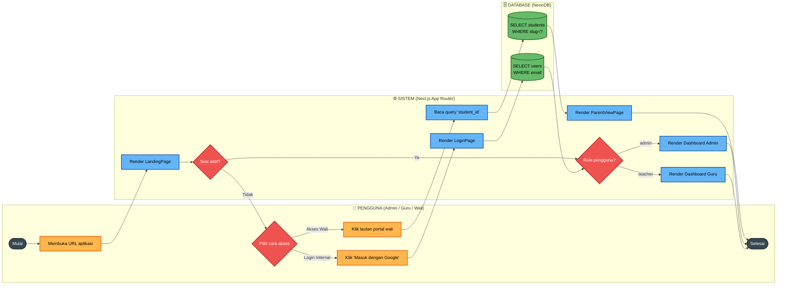
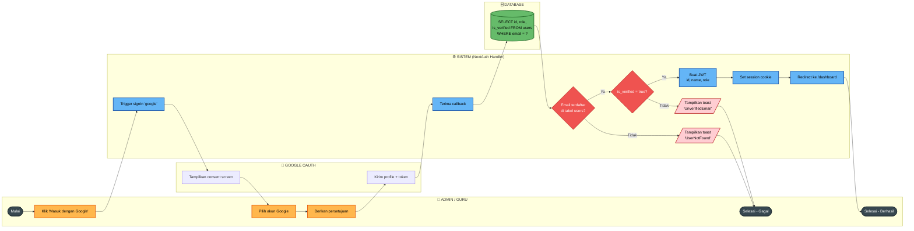
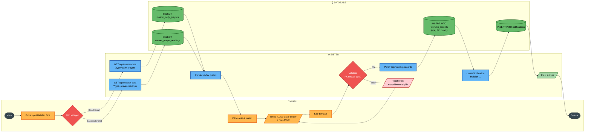
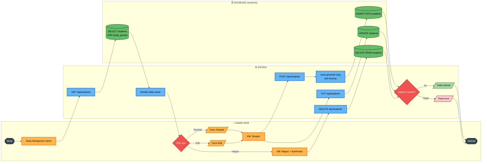
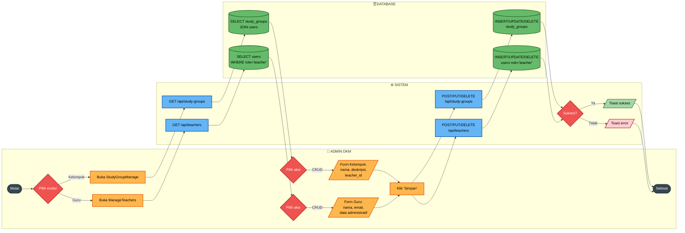
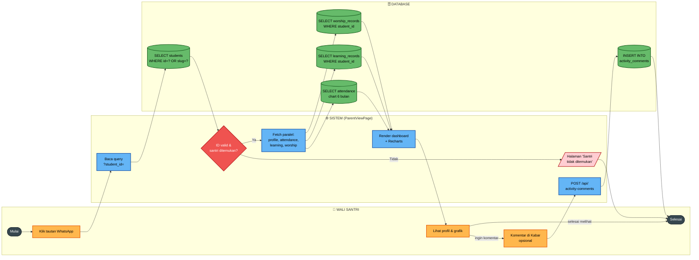

# FLOWCHART SISTEM YANG DIUSULKAN
## Sistem Pemantauan Akademik dan Hafalan Santri MDA Masjid Nurul Huda

> Dokumen ini berisi sepuluh *flowchart* (berwujud *Activity Diagram* dengan
> *swimlane* per aktor/sistem) yang menggambarkan alur proses utama pada
> sistem yang diusulkan. Notasi mengikuti simbol standar:
>
> | Simbol | Arti |
> |---|---|
> | `([Mulai/Selesai])` | Kapsul terminator |
> | `[Proses]` | Kotak aksi |
> | `{Keputusan}` | Belah ketupat *(diamond)* |
> | `[(Database)]` | Silinder penyimpanan data |
> | `[/Form / I-O/]` | Paralelogram input/output |
>
> **Konvensi Warna (konsisten di seluruh diagram)**
>
> | Class | Warna | Penanda Untuk |
> |---|---|---|
> | `terminator` | Abu‑gelap | Mulai / Selesai |
> | `actor` | Oranye | Aksi pengguna (klik, isi form) |
> | `system` | Biru | Proses sistem/API/aplikasi |
> | `decision` | Merah | Diamond keputusan |
> | `db` | Hijau | Operasi database / Vercel Blob |
> | `success` | Hijau muda | Notifikasi/Hasil sukses |
> | `error` | Merah muda | Pesan/Cabang gagal |
>
> *Cara render:* GitHub me-render Mermaid otomatis. Di VS Code pasang
> *Markdown Preview Mermaid Support*. Untuk ekspor PNG: salin blok kode ke
> [https://mermaid.live](https://mermaid.live) → Actions → PNG.

---

## Daftar Isi

1. [Flowchart Umum Sistem](#1-flowchart-umum-sistem)
2. [Login Google OAuth (Admin & Guru)](#2-login-google-oauth-admin--guru)
3. [Input Presensi Harian (Guru)](#3-input-presensi-harian-guru)
4. [Input Setoran Tilawah Iqro/Al-Qur'an (Guru)](#4-input-setoran-tilawah-iqroal-quran-guru)
5. [Input Setoran Hafalan Doa & Bacaan Sholat (Guru)](#5-input-setoran-hafalan-doa--bacaan-sholat-guru)
6. [Manajemen Santri / CRUD (Admin)](#6-manajemen-santri--crud-admin)
7. [Manajemen Kelompok Belajar & Guru (Admin)](#7-manajemen-kelompok-belajar--guru-admin)
8. [Posting Kabar dengan Lampiran Foto](#8-posting-kabar-dengan-lampiran-foto)
9. [Portal Wali Santri — Publik Tanpa Login](#9-portal-wali-santri--publik-tanpa-login)
10. [Cetak Laporan PDF Santri](#10-cetak-laporan-pdf-santri)

---

## 1. Flowchart Umum Sistem

**Deskripsi.** Menggambarkan alur tingkat tinggi seorang pengguna ketika
membuka aplikasi: mulai dari pengecekan sesi (session) sampai diarahkan ke
halaman yang sesuai dengan perannya (Admin DKM, Guru, atau Wali Santri).
Diagram ini menjadi peta umum sebelum masuk ke alur-alur fitur spesifik.



**Penjelasan langkah utama:**

| Node | Aktivitas |
|---|---|
| `U1` | Pengguna membuka URL aplikasi MDA Masjid Nurul Huda. |
| `S2` | Sistem memeriksa apakah ada *session* JWT NextAuth yang valid. |
| `U3` | Bercabang menjadi (a) login admin/guru atau (b) tautan portal wali. |
| `S4` | Untuk wali, `student_id`/slug diambil dari *query string* tanpa autentikasi. |
| `S5` | Berdasarkan `role` pada token, sistem mengarahkan ke dashboard yang sesuai. |

---

## 2. Login Google OAuth (Admin & Guru)

**Deskripsi.** Menggambarkan proses otentikasi pengguna internal (Admin DKM
dan Guru) menggunakan Google OAuth via NextAuth. Sistem memvalidasi bahwa
email yang login sudah terdaftar **dan** sudah terverifikasi pada tabel
`users` sebelum sesi diberikan.



**Penjelasan langkah utama:**

1. Pengguna menekan tombol **Masuk dengan Google** sehingga frontend memanggil `signIn('google')`.
2. Google menampilkan *consent screen* kemudian mengirimkan profil ke *callback* NextAuth.
3. Sistem melakukan kueri `SELECT` ke tabel `users` berdasarkan email.
4. Bila email tidak ada → arahkan ke halaman dengan pesan **UserNotFound**.
5. Bila email belum terverifikasi → tampilkan pesan **UnverifiedEmail**.
6. Bila valid → buat JWT (id, name, role) dan arahkan ke `/dashboard`.

---

## 3. Input Presensi Harian (Guru)

**Deskripsi.** Guru membuka halaman presensi, mengambil daftar santri pada
kelompok yang diampunya, lalu menandai status kehadiran setiap santri
(`HADIR / SAKIT / IZIN / ALPA`). Saat disimpan, sistem memakai strategi
**replace** (hapus dulu data tanggal yang sama, lalu insert ulang) untuk
mencegah duplikasi.

```mermaid
flowchart LR
    classDef terminator fill:#37474F,color:#fff,stroke:#263238,stroke-width:2px
    classDef actor fill:#FFB74D,color:#000,stroke:#E65100,stroke-width:2px
    classDef system fill:#64B5F6,color:#000,stroke:#0D47A1,stroke-width:2px
    classDef decision fill:#EF5350,color:#fff,stroke:#B71C1C,stroke-width:2px
    classDef db fill:#66BB6A,color:#000,stroke:#1B5E20,stroke-width:2px
    classDef success fill:#A5D6A7,color:#000,stroke:#2E7D32,stroke-width:2px
    classDef error fill:#FFCDD2,color:#000,stroke:#B71C1C,stroke-width:2px

    subgraph G["👤 GURU"]
        direction TB
        G1([Mulai])
        G2[Buka halaman Presensi]
        G3[/Pilih tanggal<br/>& kelompok/]
        G4[Tandai status tiap santri]
        G5[Klik tombol 'Simpan']
        G6([Selesai])
    end

    subgraph S["⚙️ SISTEM (PresensiPage + API)"]
        direction TB
        S1[GET /api/students<br/>?teacher_id=]
        S2[Render daftar santri]
        S3{Semua santri<br/>sudah ditandai?}
        S4[POST /api/attendance<br/>array records]
        S5[Validasi payload]
        S6[Loop setiap record]
        S7[createNotification<br/>broadcast]
        S8[/Tampilkan toast<br/>sukses N data/]
        S9[/Toast error:<br/>lengkapi data/]
    end

    subgraph D["🗄️ DATABASE (attendance)"]
        direction TB
        D1[(SELECT students<br/>JOIN study_groups)]
        D2[(DELETE FROM attendance<br/>WHERE student_id=$1<br/>AND date=$2)]
        D3[(INSERT INTO attendance<br/>status, notes, ...)]
        D4[(INSERT INTO<br/>notifications)]
    end

    G1 --> G2 --> S1 --> D1 --> S2 --> G3 --> G4 --> G5 --> S3
    S3 -- Tidak --> S9 --> G4
    S3 -- Ya --> S4 --> S5 --> S6
    S6 --> D2 --> D3 --> S7 --> D4 --> S8 --> G6

    class G1,G6 terminator
    class G2,G3,G4,G5 actor
    class S1,S2,S4,S5,S6,S7 system
    class S3 decision
    class D1,D2,D3,D4 db
    class S8 success
    class S9 error
```



**Penjelasan langkah utama:**

1. `GET /api/students?teacher_id=...` mengambil santri sesuai kelompok guru.
2. Guru menandai status setiap santri (HADIR/SAKIT/IZIN/ALPA) dan, opsional, menulis catatan.
3. `POST /api/attendance` mengirim seluruh *record* sekaligus (bulk).
4. Untuk setiap record sistem menjalankan `DELETE` lalu `INSERT` agar idempoten.
5. Notifikasi broadcast dipicu untuk dilihat oleh admin/guru lain.

---

## 4. Input Setoran Tilawah Iqro/Al-Qur'an (Guru)

**Deskripsi.** Setelah memilih santri, sistem otomatis mengambil setoran
sebelumnya sebagai *auto-fill* (continuity). Guru mengisi tipe (Iqro atau
Al-Qur'an), level/surah, halaman/ayat awal-akhir, nilai (A‑D) dan catatan,
lalu menyimpan.

```mermaid
flowchart LR
    classDef terminator fill:#37474F,color:#fff,stroke:#263238,stroke-width:2px
    classDef actor fill:#FFB74D,color:#000,stroke:#E65100,stroke-width:2px
    classDef system fill:#64B5F6,color:#000,stroke:#0D47A1,stroke-width:2px
    classDef decision fill:#EF5350,color:#fff,stroke:#B71C1C,stroke-width:2px
    classDef db fill:#66BB6A,color:#000,stroke:#1B5E20,stroke-width:2px
    classDef success fill:#A5D6A7,color:#000,stroke:#2E7D32,stroke-width:2px
    classDef error fill:#FFCDD2,color:#000,stroke:#B71C1C,stroke-width:2px

    subgraph G["👤 GURU"]
        direction TB
        G1([Mulai])
        G2[Buka halaman Input Tilawah]
        G3[Pilih santri]
        G4[/Form: tipe, surah,<br/>start-end, nilai, notes/]
        G5[Klik 'Simpan Setoran']
        G6([Selesai])
    end

    subgraph S["⚙️ SISTEM (InputIqroPage + API)"]
        direction TB
        S1[GET /api/students<br/>?teacher_id=]
        S2[GET /api/learning-records<br/>?student_id=&before_date]
        S3[Auto-fill form<br/>level & end_point]
        S4{Validasi form<br/>lengkap & batas ayat?}
        S5[POST /api/learning-records]
        S6[createNotification<br/>'Setoran ...']
        S7[/Toast sukses/]
        S8[/Toast error:<br/>field tidak valid/]
    end

    subgraph D["🗄️ DATABASE"]
        direction TB
        D1[(SELECT students<br/>WHERE teacher_id)]
        D2[(SELECT learning_records<br/>terakhir per santri)]
        D3[(INSERT INTO<br/>learning_records)]
        D4[(INSERT INTO<br/>notifications)]
    end

    G1 --> G2 --> S1 --> D1 --> G3 --> S2 --> D2 --> S3 --> G4 --> G5 --> S4
    S4 -- Tidak --> S8 --> G4
    S4 -- Ya --> S5 --> D3 --> S6 --> D4 --> S7 --> G6

    class G1,G6 terminator
    class G2,G3,G4,G5 actor
    class S1,S2,S3,S5,S6 system
    class S4 decision
    class D1,D2,D3,D4 db
    class S7 success
    class S8 error
```



**Penjelasan langkah utama:**

1. Halaman memuat daftar santri lalu menanti pemilihan santri.
2. Setoran terakhir santri di-fetch (`before_date=today`) untuk *auto-fill*.
3. Form divalidasi termasuk batas ayat per surah (untuk QURAN) sebelum dikirim.
4. Hasil penyimpanan memicu notifikasi broadcast.

---

## 5. Input Setoran Hafalan Doa & Bacaan Sholat (Guru)

**Deskripsi.** Guru memilih kategori (Doa Harian / Bacaan Sholat), sistem
memuat *bank materi* dari tabel master. Validasi memastikan field referensi
(`daily_prayer_id` atau `prayer_reading_id`) terisi sesuai tipe.



**Penjelasan langkah utama:**

1. Sistem memuat materi dari tabel master sesuai kategori yang dipilih.
2. Validasi memastikan: bila `type='DOA_HARIAN'` maka `daily_prayer_id` wajib terisi; bila `type='BACAAN_SHOLAT'` maka `prayer_reading_id` wajib terisi.
3. Catatan disimpan ke `worship_records` dan memicu notifikasi.

---

## 6. Manajemen Santri / CRUD (Admin)

**Deskripsi.** Admin DKM dapat menambah, mengubah, atau menghapus data
santri. Setiap operasi memanggil endpoint yang berbeda dan memperbarui
tabel `students`. Slug otomatis di-*generate* bila kosong saat tambah.



**Penjelasan langkah utama:**

| Aksi | Endpoint | Operasi DB |
|---|---|---|
| Tambah | `POST /api/students` | `INSERT` (slug auto bila kosong) |
| Edit | `PUT /api/students` | `UPDATE` dengan COALESCE |
| Hapus | `DELETE /api/students?id=` | `DELETE` cascade ke catatan terkait |

---

## 7. Manajemen Kelompok Belajar & Guru (Admin)

**Deskripsi.** Alur kelola kelompok belajar dan data guru oleh Admin DKM.
Operasi pada dua entitas saling berkaitan karena kelompok memiliki
`teacher_id` sebagai *foreign key* ke `users`.



**Penjelasan langkah utama:**

- Modul **Kelompok Belajar** mengelola tabel `study_groups` dengan referensi `teacher_id → users.id` (`ON DELETE SET NULL`).
- Modul **Data Guru** menambah/menghapus baris pada tabel `users` dengan `role='teacher'` (default password awal `teacher123`).

---

## 8. Posting Kabar dengan Lampiran Foto

**Deskripsi.** Admin atau Guru membuat *post* berita kegiatan. Setiap foto
diunggah dahulu ke **Vercel Blob** sehingga DB hanya menyimpan URL. Setelah
seluruh foto siap, satu permintaan `POST /api/activities` membuat record
`activity_posts` dan banyak record `activity_images`.

```mermaid
flowchart LR
    classDef terminator fill:#37474F,color:#fff,stroke:#263238,stroke-width:2px
    classDef actor fill:#FFB74D,color:#000,stroke:#E65100,stroke-width:2px
    classDef system fill:#64B5F6,color:#000,stroke:#0D47A1,stroke-width:2px
    classDef decision fill:#EF5350,color:#fff,stroke:#B71C1C,stroke-width:2px
    classDef db fill:#66BB6A,color:#000,stroke:#1B5E20,stroke-width:2px
    classDef success fill:#A5D6A7,color:#000,stroke:#2E7D32,stroke-width:2px
    classDef error fill:#FFCDD2,color:#000,stroke:#B71C1C,stroke-width:2px

    subgraph U["👤 ADMIN / GURU"]
        direction TB
        U1([Mulai])
        U2[Buka halaman Kabar]
        U3[Klik 'Posting Baru']
        U4[/Pilih foto<br/>satu/lebih/]
        U5[/Isi judul, isi,<br/>tanggal kegiatan/]
        U6[Klik 'Publikasikan']
        U7([Selesai])
    end

    subgraph S["⚙️ SISTEM (KabarPage + API)"]
        direction TB
        S1[Loop tiap foto:<br/>POST /api/upload]
        S2[Kompresi ke WebP]
        S3[Kumpulkan array URL]
        S4{Semua field<br/>terisi?}
        S5[POST /api/activities]
        S6[Loop INSERT images]
        S7[/Refresh feed +<br/>toast sukses/]
        S8[/Toast error:<br/>upload gagal/]
        S9[/Toast error:<br/>field kosong/]
    end

    subgraph V["☁️ VERCEL BLOB"]
        direction TB
        V1[(Simpan file)]
        V2[Return public URL]
    end

    subgraph D["🗄️ DATABASE"]
        direction TB
        D1[(INSERT INTO<br/>activity_posts)]
        D2[(INSERT INTO<br/>activity_images)]
    end

    U1 --> U2 --> U3 --> U4 --> S1 --> S2 --> V1 --> V2 --> S3
    S2 -. gagal .-> S8 --> U7
    S3 --> U5 --> U6 --> S4
    S4 -- Tidak --> S9 --> U5
    S4 -- Ya --> S5 --> D1 --> S6 --> D2 --> S7 --> U7

    class U1,U7 terminator
    class U2,U3,U4,U5,U6 actor
    class S1,S2,S3,S5,S6 system
    class S4 decision
    class V1,V2,D1,D2 db
    class S7 success
    class S8,S9 error
```



**Penjelasan langkah utama:**

1. Setiap foto diunggah satu per satu ke endpoint `/api/upload` yang meneruskannya ke Vercel Blob dan mengembalikan URL publik.
2. Foto dikompresi otomatis menjadi format WebP untuk menghemat *bandwidth*.
3. Setelah semua foto siap, frontend mengirim *payload* ke `/api/activities` berisi array URL.
4. Server menyisipkan satu baris ke `activity_posts` lalu *loop insert* ke `activity_images`.

---

## 9. Portal Wali Santri — Publik Tanpa Login

**Deskripsi.** Wali santri membuka tautan unik berisi `student_id` (atau
slug) yang dibagikan via WhatsApp. Sistem **tidak memerlukan login**;
keamanan bersandar pada panjangnya identifier. Halaman memuat data secara
paralel: profil santri, grafik kehadiran, riwayat tilawah, dan hafalan.



**Penjelasan langkah utama:**

1. Sistem mengambil `student_id` atau `slug` dari *query string* tanpa proses autentikasi.
2. Bila santri tidak ditemukan, ditampilkan halaman ramah-pengguna **Santri tidak ditemukan**.
3. Bila ditemukan, empat sumber data diambil paralel agar halaman cepat dimuat.
4. Wali dapat menambahkan komentar pada *post* Kabar (opsional, dengan field `parent_name`).

---

## 10. Cetak Laporan PDF Santri

**Deskripsi.** Wali Santri (atau Admin) mencetak laporan progres santri ke
PDF. Pembuatan PDF dilakukan **di sisi klien** dengan `html2canvas` agar
tidak membebani server. Halaman khusus berada di route `/laporan/[studentId]`.

```mermaid
flowchart LR
    classDef terminator fill:#37474F,color:#fff,stroke:#263238,stroke-width:2px
    classDef actor fill:#FFB74D,color:#000,stroke:#E65100,stroke-width:2px
    classDef system fill:#64B5F6,color:#000,stroke:#0D47A1,stroke-width:2px
    classDef decision fill:#EF5350,color:#fff,stroke:#B71C1C,stroke-width:2px
    classDef db fill:#66BB6A,color:#000,stroke:#1B5E20,stroke-width:2px
    classDef success fill:#A5D6A7,color:#000,stroke:#2E7D32,stroke-width:2px
    classDef error fill:#FFCDD2,color:#000,stroke:#B71C1C,stroke-width:2px

    subgraph W["👤 WALI / ADMIN"]
        direction TB
        W1([Mulai])
        W2[Klik 'Cetak Laporan']
        W3[Tunggu render selesai]
        W4[Klik 'Simpan PDF']
        W5([Selesai])
    end

    subgraph C["🖥️ BROWSER (LaporanClient)"]
        direction TB
        C1[Buka /laporan/<br/>[studentId]]
        C2[Render template<br/>HTML laporan]
        C3[html2canvas:<br/>capture DOM ke canvas]
        C4[jsPDF: konversi<br/>canvas ke PDF]
        C5{File berhasil<br/>dibuat?}
        C6[Trigger download<br/>laporan_NAMA.pdf]
        C7[/Toast error/]
    end

    subgraph S["⚙️ SISTEM / API"]
        direction TB
        S1[Fetch profil &<br/>riwayat lengkap]
    end

    subgraph D["🗄️ DATABASE"]
        direction TB
        D1[(SELECT students,<br/>attendance, learning,<br/>worship)]
    end

    W1 --> W2 --> C1 --> S1 --> D1 --> C2 --> W3 --> W4 --> C3 --> C4 --> C5
    C5 -- Ya --> C6 --> W5
    C5 -- Tidak --> C7 --> W5

    class W1,W5 terminator
    class W2,W3,W4 actor
    class C1,C2,C3,C4,C6,S1 system
    class C5 decision
    class D1 db
    class C7 error
```

**Penjelasan langkah utama:**

1. Halaman `/laporan/[studentId]` di-*server-render* awal lalu memuat data riwayat santri.
2. `html2canvas` menangkap DOM laporan menjadi *canvas*, kemudian `jsPDF` mengubahnya menjadi *file* PDF.
3. Karena seluruh proses berjalan di sisi klien, server tidak perlu menyediakan *PDF generator* terpisah (`/api/export-pdf` hanya berstatus *stub*).

---

## Catatan Implementasi & Konsistensi

- **Notifikasi.** Diagram 3, 4, dan 5 memanggil `createNotification()` di sisi server. Helper ini bersifat *non-blocking* — kegagalan menulis notifikasi tidak membatalkan transaksi utama (try/catch dengan log).
- **Strategi query.** Operasi *CRUD* memakai *raw SQL parameterized* via `lib/api-helpers.ts`. Drizzle ORM hanya dipakai untuk migrasi schema dan callback NextAuth.
- **Replace strategy.** Hanya digunakan pada `attendance` agar penyimpanan ulang tanggal yang sama tidak menghasilkan duplikat.
- **Auto-fill.** Hanya berlaku pada `learning_records` (Iqro/Quran). Untuk `worship_records` *bank materi* dipilih manual.
- **Akses publik.** Diagram 9 dan 10 sengaja tidak melewati pemeriksaan sesi NextAuth. Pembatasannya bersifat *security through obscurity* dengan slug/ID panjang.

## Cara Mengekspor ke Gambar PNG

1. Buka [https://mermaid.live](https://mermaid.live).
2. Salin satu blok kode `mermaid` dari dokumen ini ke kolom kiri.
3. Pilih menu **Actions → Download PNG/SVG**.
4. Sertakan gambar tersebut di dokumen Tugas Akhir (Bab III, sub-bab 3.x **Sistem Yang Diusulkan**) bersama narasi pada bagian "Penjelasan langkah utama".

> Sumber acuan: `docs/BAB_III_Analisis_Sistem.md`, `PROJECT_SUMMARY.md`,
> dan analisis kode pada `app/api/**/route.ts` serta `components/pages/**`.
